# Power BI Embedded

### Estimated Duration: 4 Hours

## Overview

**Power BI Embedded** enables the integration of interactive data visualizations into applications. It allows embedding of **Power BI** reports, managing authentication through **Azure AD**, and using the **Power BI REST API** to deliver embedded business intelligence features.

## Lab Objectives

You will be able to complete the following tasks:

- **Module 1:** Embed a Power BI report using App Owns Data embedding
- **Module 2:** Embed Q&A (Question & Answer) for a Power BI dataset
- **Module 3:** Understand exporting a visual’s data 
- **Module 4:** Enable data security based on user context

## Module 1: Embedding Your First Power BI report

In this module, you will embed a Power BI report into your application using the App Owns Data embedding method.

1. From the left navigation pane, click **Workspaces (1)**, select the **ellipsis (...) (2)** next to your **hacker<inject key="DeploymentID" enableCopy="false" />** workspace, and click **Workspace access (3)**.

    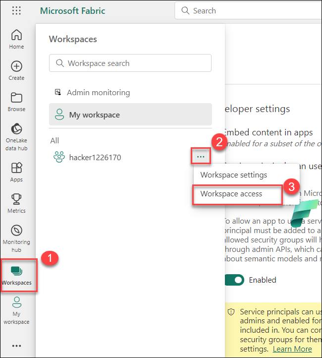

1. In the Manage access panel, click **+ Add people or groups**.
   
    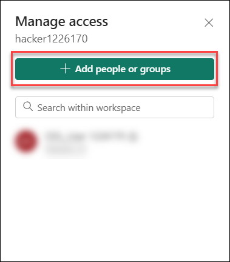

    >**Note**: If the window does not appear, try opening the portal in an InPrivate browser window. 
   
1. In the Add people window, type and select **PowerbiSDP (1)** in the search box, use the **dropdown (2)** to select **Admin (3)** role, click **Add (4)**, then click the **X (5)** button to exit the panel.

    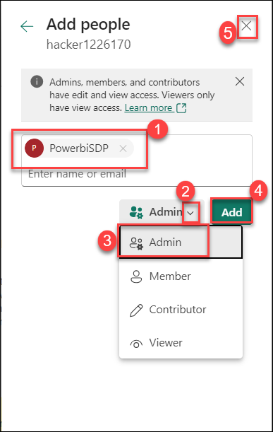  

1. From the left navigation pane, open the **hacker<inject key="DeploymentID" enableCopy="false" />** **(1)** workspace and select the **Wingtip Sales Analysis (2)** report.

       

1. From the browser’s address bar, copy the **Workspace ID (1)** and **Report ID (2)**, then save them in a notepad for use in later steps.

     

1. Go back to the **hacker<inject key="DeploymentID" enableCopy="false" />** **(1)** workspace from the left navigation pane and select the **Wingtip Sales Analysis (2)** semantic model.

    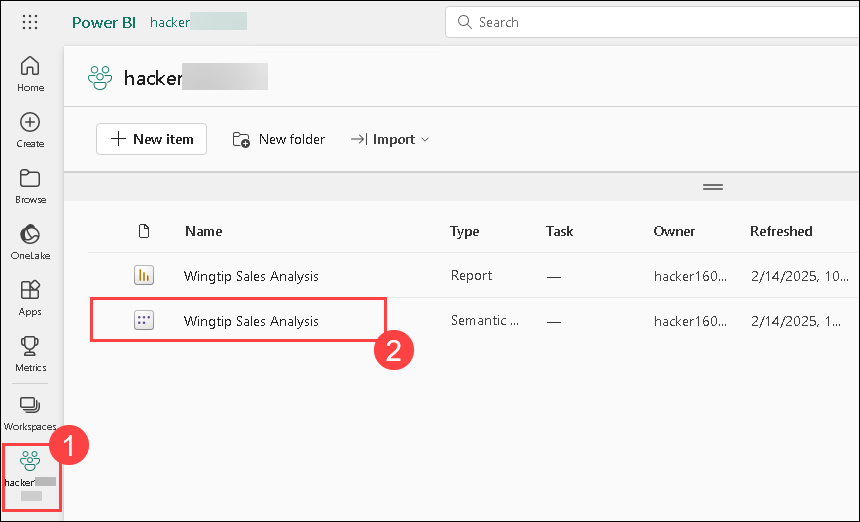   
    
1. From the browser’s address bar, copy the **Dataset ID** and save it in a notepad for use in later steps

       

1. From the taskbar, click the **Visual Studio Code** icon to launch the application.

    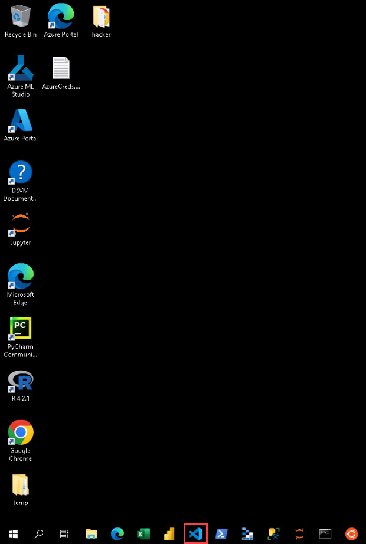 

   >**Note** : The application might take a few seconds to load.

1. In the VS Code, click on **Open Folder** and navigate to `C:\Users\hacker1\Desktop\hacker` path and make sure to select and open the folder **Power BI Embedded workshop_latest**. 

      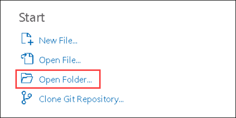

      >**Note**: If prompted with the **Do you trust the authors of the files in this folder?** pop-up, click **Yes, I trust the authors**.

      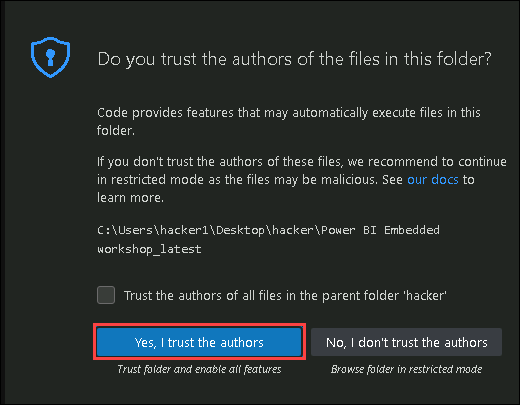 
  
1. Once the folder is open, click on the **appsettings.json (2)** to open it, replace **ClientId (Application ID), TenantId, ClientSecret (Secret key) (3)** in the lines 5,6, and 10 respectively. You can find these Id's under the **Service Principal Details** option in the **Environment Details (4)** tab. After replacing the required Id's save the file using **CTRL+S**. Compare the **WorkspaceId**, **ReportId**, and **DatasetId** in lines 13, 14, and 15 with the Id's you copied in previous steps. 

   >**Note:** The Id's are automatically replaced with the workspace ID, Report ID, and Dataset ID of hacker<inject key="DeploymentID" enableCopy="false" /> workspace respectively.

    
   
1. Click the **ellipsis (⋯) (1)** from the top menu, go to **Terminal (2)**, and select **New Terminal (3)**.

    

1. Run the command below and press **Enter** to execute the sample code that embeds the `Wingtip Sales Analysis` Power BI report in READ mode, then observe the output.

    ```
   dotnet run
    ```
   
   >**Note** : If you encounter any errors, run `dotnet dev-certs https` in the terminal, then re-run the application using `dotnet run`.

1. Once the code is executed, hold the `Ctrl` key and click the link `https://localhost:5001`
 in the terminal to launch the browser and open the app.

   

1. In the web browser, if you see a **Your connection isn’t private** warning, click **Advanced (1)**, then choose **Continue to localhost (unsafe) (2)**.

      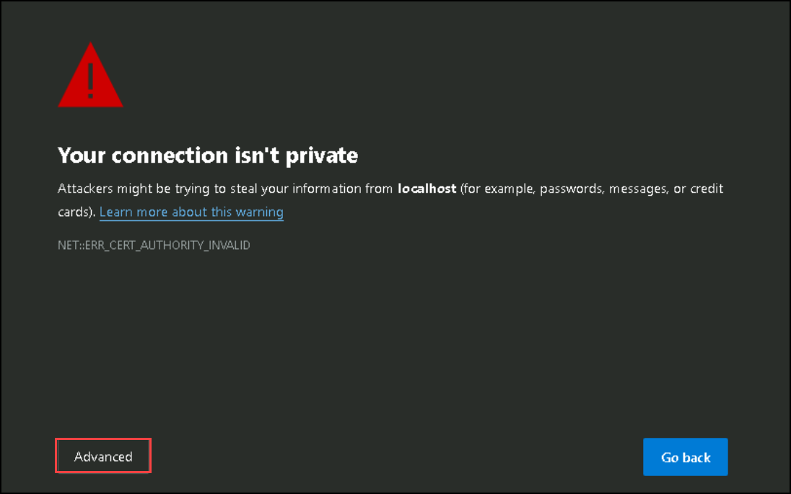

      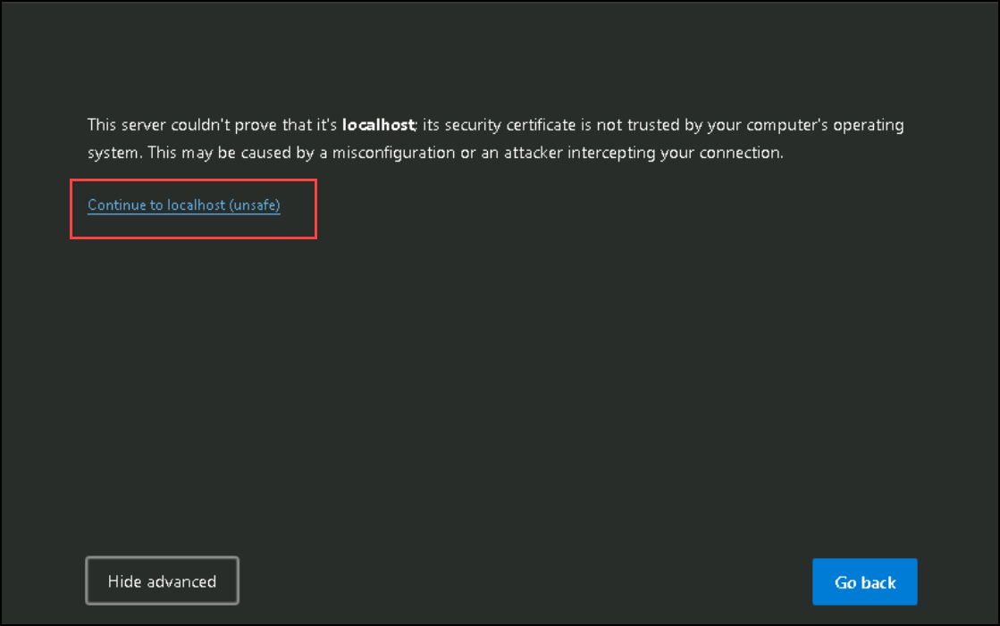

1. Once the browser launches, you should see the web app displaying your **Wingtip Sales Analysis** report embedded from Power BI.

    

1. Navigate and explore the report and note the interactivity. Now, leave the browser open.

1. In Visual Studio Code, open the **`/wwwroot/js/index.js` file (1)**, then **uncomment** the WRITE MODE embedding code on **line 59 (2)**, and save the changes.

    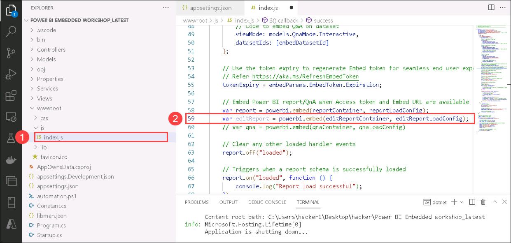

1. After refreshing, you’ll see the **Wingtip Sales Analysis** report embedded twice—one in read-only mode and the second with full edit capabilities.

    >**Note:** If you are not able to find and edit the report, please access the same URL in a different web browser or in InPrivate window.
   
    

1. From the report canvas on the left-hand pane, select the existing **chart (1)**, then from the Visualizations pane on the right, change the chart type to a **Donut chart** by clicking the corresponding **icon (2)** near the middle of the pane.

    

    >**Note:** You can also click on the ellipsis (...) on the chart, choose New visual calculation, and select the Donut chart to update the embedded report.

    

1. From the top-left corner, click **File (1**), select **Save as (2)**, enter **Wingtip Sales Analysis updated Report (3)** in the prompt, and then click **Save (4)** to save your changes.

    

1. Go to the browser tab where your **hacker<inject key="DeploymentID" enableCopy="false" />** workspace is open, then refresh the page to load and visualize the updated report.

    

   In this module, you have learned to embed a report in Read and Edit mode.

## Module 2: Embedding Q&A

In this module, you will integrate the Q&A feature in Power BI to allow users to query the dataset using natural language.

1. In VS Code, open the file `/wwwroot/js/index.js` and confirm that the **Dataset ID** on **line #11** is already updated.

    

1. In the same index.js file, **uncomment** the Q&A embed code at **line #60** to enable embedding the Q&A visual, then save your changes using **CTRL+S**.

       

1. Navigate back to the browser and refresh the web page. Scroll down to the bottom, click the **Ask a question about your data button (1)**, enter the query **top customer states by units sold (2)** in the input box, and observe the visualized results.

    

    >**Note:** You can also type **top 5 customer segments by customer unit** as a custom question and check the results.

   In this module, you have learned to embed Q&A into your web application.   

## Module 3: Export to CSV

In this module, you will learn how to export the underlying data from a Power BI visual for further analysis.

1. Navigate back to VS Code, open the `/wwwroot/js/index.js` file, comment **line #12** by adding `//` before the export statement to enable the **Export to CSV** button, and press **CTRL+S** to save the changes.

   

1. Navigate back to the browser and refresh the web page; then, from the top right of the embedded report, click the **Export to CSV** button. A **CSV** file containing the exported data will automatically be downloaded.

   

1. Alternatively, you can export visual-specific data by clicking the **ellipsis (...) (1)** icon from the top-right corner of the visual and selecting **Export data (2)** from the dropdown menu.

      

1. In the **Which data do you want to export?** popup, choose **Summarized data (1)**, select **.csv (30,000-row max) (2)** as the file format from the dropdown, and click **Export (3)** to download the data.

   

## Module 4: Embedding with RLS

In this module, we will create a role to enable row level security. In our case, we are going to apply row level security (RLS) on Internal v/s External stores so that, internal users can only see internal sales data and external users can only see external sales data.

1. From Desktop, open **File explorer (1)**, navigate to `C:\LabFiles` **(2)** directory, and open **Sales and Returns Sample without RLS.pbix (3)** file.

   

1. If Enter your email address pop-up appears, Provide the **Email: <inject key="AzureAdUserEmail"></inject>** **(1)**  and click on **Continue**.

      

1. Now enter the following password and click on **Sign in**.
   
   * **Password**: <inject key="AzureAdUserPassword"></inject>
   
      

1. In the Power BI application, select **Modelling (1)** tab, click on **Manage roles (2)**, and click on **Create (3)** button.

   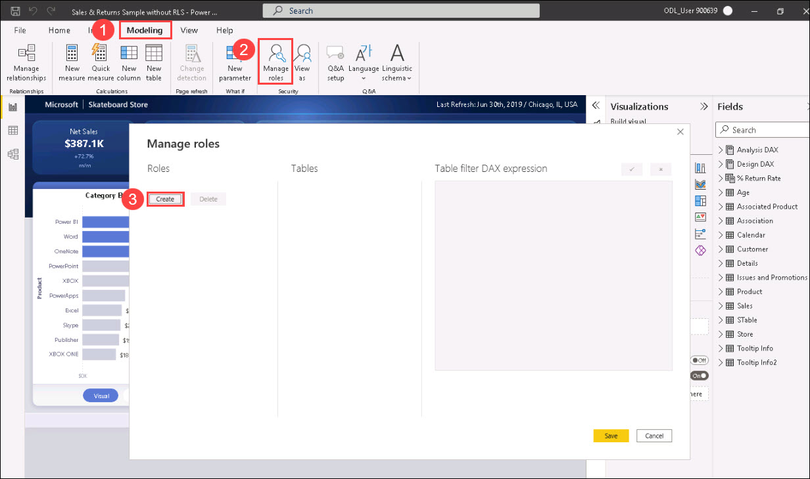

1. Follow the below-mentioned steps to create the role.

   - Create a role named **john (1)**.
   - Select **Store (2)** table.
   - Enter `[Type] = "External"` **(3)** in Table filter DAX expression and click on **verify (4)**. 
   - Finally, click on **Save (4)** button.

   

1. Click on **File** present in top left corner.

   

1. Click on the **Save** button to save the report.

   

1. Click on **File** present in top left corner. Click on **publish (1)** button and select **Publish to Power BI (2)**.

   

1. Select the **hacker<inject key="DeploymentID" enableCopy="false" />** workspace and click on **Select (2)**.

   
   
   > **Note**: If it ask for Replace this dataset? click on **Replace**

     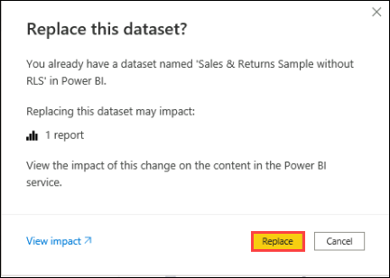 

   > **Note**: Please wait until the report gets published.

1. From the browser tab, open **hacker<inject key="DeploymentID" enableCopy="false" />** workspace and select **Sales & Returns Sample without RLS (2)** report.

   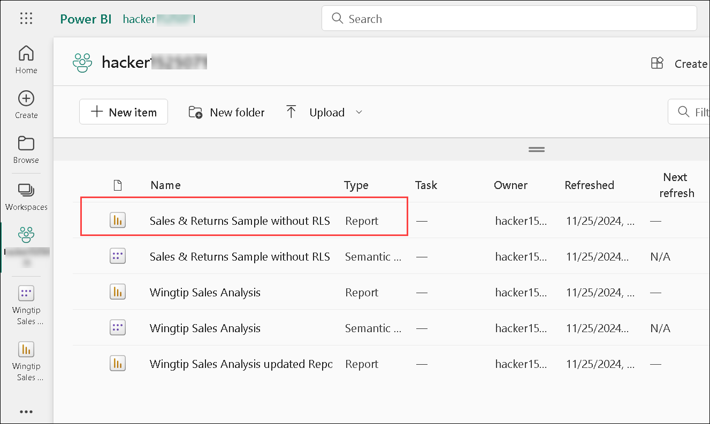   

1. Copy the **Workspace ID (1)** and **Report ID (2)** from the URL. Save it in a notepad and you'll be using the value in further steps.

    

1. From the browser tab, open **hacker<inject key="DeploymentID" enableCopy="false" />** workspace and select **Sales & Returns Sample without RLS (2)** semantic model.

   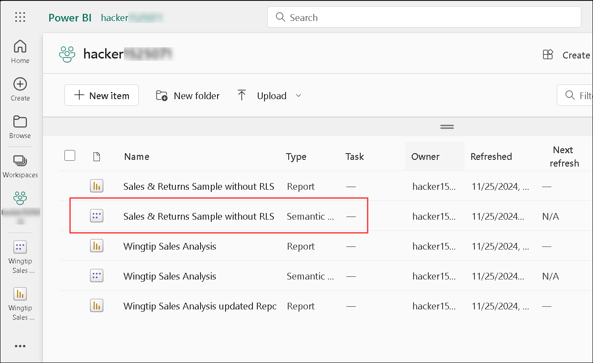   
    
1. Copy the **Datsaset ID (1)** and save it in a notepad. You'll be using the value in further steps.

       

1. Navigate back to VS Code, open `/Services/PBIEmbedService.cs` **(1)** file and **uncomment** line `#118` **(2)** and save the code using **CTRL+S**.

   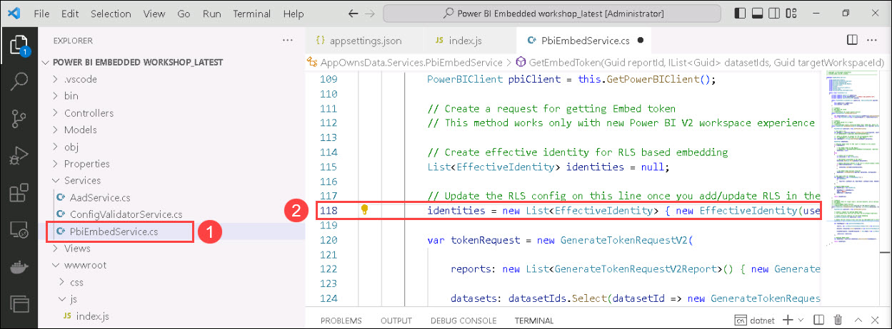 

1. Review that the Username and role values to the new role that you have created in PBI Desktop are already updated.

    
    
1. Like in Module 1 earlier, navigate to /appsettings.json file and update the **workspace ID**, **Report ID**, and **Dataset ID** parameters copied in previous steps to reflect the new report “Sales and Returns Sample without RLS”. Save the code using **CTRL+S**.

   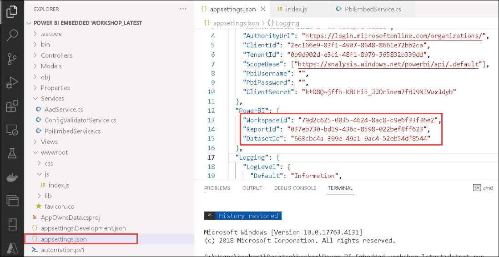 

1. Click on the **Ellipsis (...) (1)** from the top, click on **Terminal (2)** and select **New Terminal (3)**.

      

1. Run the below command and press **Enter** to run the sample code.

    ```
   dotnet run
    ```

   >**Note** : If the sample code from Module 1 is still running, use Ctrl + C to stop it, and then execute the `dotnet run` command.

1. Once the code is executed, hold the `Ctrl` key and click on the link `https://localhost:5001` to launch the browser/app:   

     

1. Now, you can see that the numbers in the visual are slightly on the lower side due to the user (john) 
specific filtering. You can compare the **Power BI Embedded Sample** report with the **Sales & Returns Sample without RLS** report which you updated in previous steps in the PowerBI desktop application.

   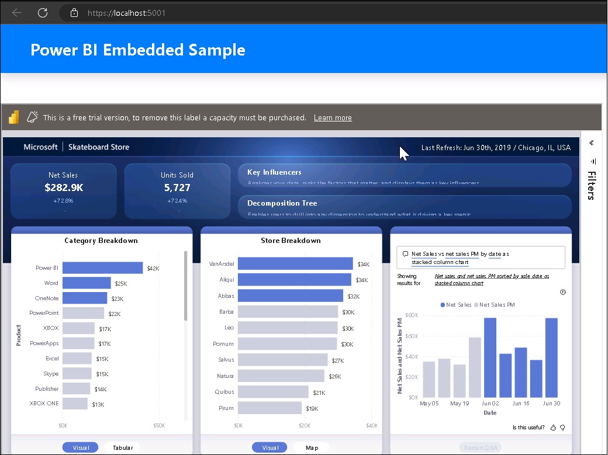
   
   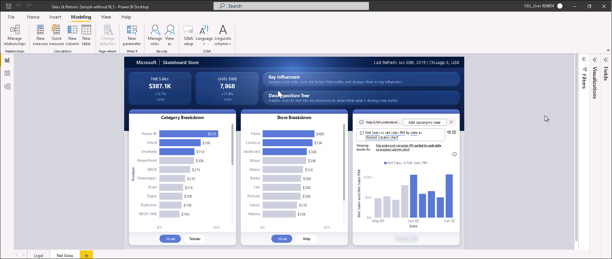

1. In this module, you have learned to embed a Power BI report with data security as per the user’s context.

## Summary 

In this lab you have covered the following:

- Embedded a Power BI report using App Owns Data embedding
- Integrated the Q&A feature in Power BI for natural language queries
- Exported data from a Power BI visual for further analysis
- Configured row-level security to ensure data security based on user context

## You have successfully completed the Hands-on lab.

By completing this hands-on lab on Power BI Embedded, you have gained practical experience in integrating Power BI capabilities into custom applications. You embedded a Power BI report using the App Owns Data embedding method, enabling seamless access to interactive reports. You also integrated the Q&A feature, allowing users to interact with data using natural language queries. Additionally, you learned how to export data from Power BI visuals for further analysis and configured row-level security (RLS) to ensure users only see data relevant to their role. This lab has equipped you with the foundational skills to build secure, interactive, and user-friendly embedded analytics solutions using Power BI.

  
